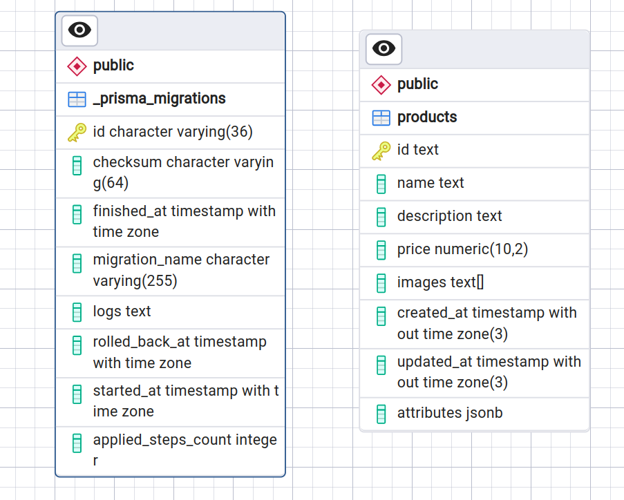
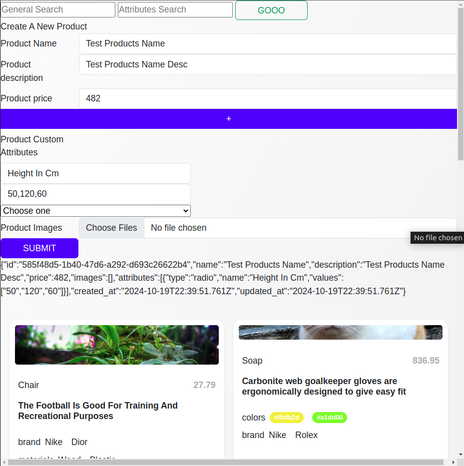

<p align="center">
  <a href="http://nestjs.com/" target="blank"></a>
</p>

[circleci-image]: https://img.shields.io/circleci/build/github/nestjs/nest/master?token=abc123def456
[circleci-url]: https://circleci.com/gh/nestjs/nest

  <p align="center">A progressive <a href="http://nodejs.org" target="_blank">Node.js</a> framework for building efficient and scalable server-side applications.</p>
 
## Description
I aimed to simplify the process by implementing only the necessary parts to achieve the task's goals. All functionalities work on REST API and some of them work on UI.

[Nest](https://github.com/nestjs/nest) framework TypeScript starter repository.
This is a demo project created to fulfill the requirements of a technical assessment.


## Requirments
You'r gonna need just Docker to run and start the project

## Compile and run the project

```bash
$ cd ecommerce-catalog
$ docker compose up
```
The Docker Compose projects will start the application along with PostgreSQL, pgAdmin, and MinIO (local file storage).

## Navigation
- application runs on [http://localhost:3000/](http://localhost:3000/)
- REST API Documtion on [http://localhost:3000/docs](http://localhost:3000/docs)
- pgadmin exposed on [http://localhost:8070/](http://localhost:8070/)
- minio will serve files on [http://localhost:9000/](http://localhost:9000/)


## Live Preivew
Data Modling

Screenshot from the app is working with demo data for easy use. Click the 'GOOO' button to list products or services. You can use the search boxes to run general searches or match custom attributes (like size=S).
The snippet also shows that you can add products/services and custom attributes as long as you want, choosing their display type (e.g., how the attribute is displayed).


